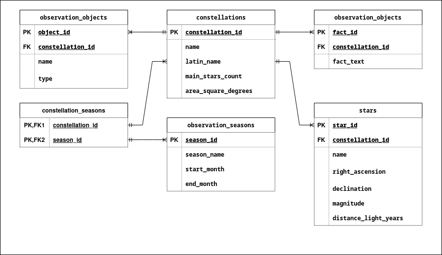

# Проектная работа по курсу БД
## Тема работы: созвездия Северного полушария
### Технологии
Язык программирования: Python

GUI: Tkinter

База данных: PostgreSQL

Операционная система: Кроссплатформенная (Linux, Windows, macOS)

### Схема базы данных


### Необходимо

Python 3.11 или выше

PostgreSQL установленный и настроенный

Библиотеки Python: psycopg2

### Настройка базы данных
Создайте базу данных PostgreSQL и выполните SQL-скрипт с таблицами, который находится в папке `sql/`.

Убедитесь, что настройки подключения к базе данных корректны в коде программы:

```python
self.conn = psycopg2.connect(
    dbname="your_db_name",
    user="your_username",
    password="your_password",
    host="localhost",
    port="5432"
)
```
### Запуск программы
`python3 main.py`